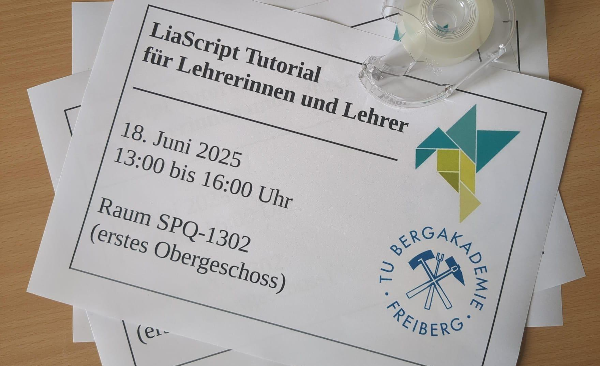
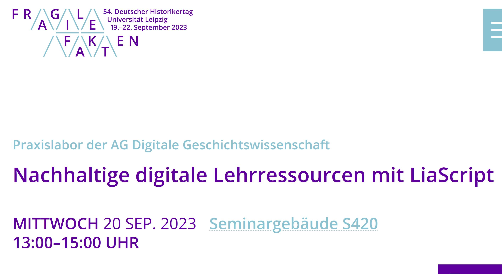
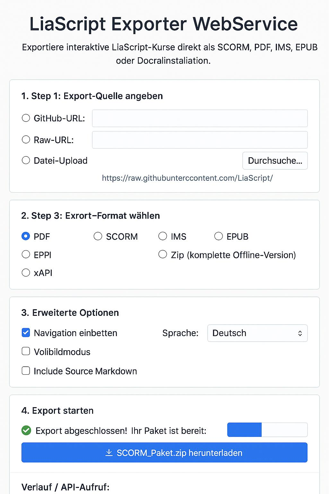

<!--
author:   Sebastian Zug, André Dietrich

email:    Sebastian.Zug@informatik.tu-freiberg.de

version:  0.0.3

language: de

narrator: Deutsch Male

edit:     true

mode:     Presentation

comment:  Pitch-Talk im Rahmen des OE_Sprints - Technische Weiterentwicklung des OER-Ökosystem

logo:     ./images/logo.png

translation: Deutsch  translations/German.md

@style
.flex-container {
    display: flex;
    flex-wrap: wrap; /* Allows the items to wrap as needed */
    align-items: stretch;
    gap: 20px; /* Adds both horizontal and vertical spacing between items */
}

.flex-child { 
    flex: 1;
    margin-right: 20px; /* Adds space between the columns */
}

@media (max-width: 600px) {
    .flex-child {
        flex: 100%; /* Makes the child divs take up the full width on slim devices */
        margin-right: 0; /* Removes the right margin */
    }
}
@end

-->

[](https://liascript.github.io/course/?https://raw.githubusercontent.com/LiaPlayground/Hackatoern2025_Pitch/refs/heads/main/README.md)

# OER Exporter für LiaScript

<section class="flex-container">

<!-- class="flex-child" style="min-width: 250px;" -->
> Wettbewerbsbeitrag für
>
> <h2>OE_Sprints - Technische Weiterentwicklung des OER-Ökosystem</h2>
>
><h4>Sebastian Zug & André Dietrich, 23. Juli 2025 </h4>

<!-- class="flex-child" style="min-width: 250px;" -->
 erweitert um LiaScript Logo")

</section>

--------------------------------------------

_ Der Quellcode kann des Open Source Dokuments ist unter [Link](https://github.com/SebastianZug/LiaScript_Workshop_Lehrende_an_Schulen/blob/main/Motivation.md) zu finden._

## Grundkonzept von LiaScript 

> [LiaScript](https://liascript.github.io/) ist eine Auszeichnungssprache für die Gestaltung von  interaktiven Lehr-Lern-Inhalte. Der Lehrende definiert den Inhalt in einer Markdown-ähnlichen Syntax, die im Browser gerendert wird. 

__Tabellen als Grafiken__

| X | B(y) | C(y) |
|---|:----:|:----:|
| 1 |   2  |   3  |
| 4 |   5  |   6  |

__Quizze__

Wann wurde die TU Bergakademie Freiberg gegründet?

- [(X)] 1765
- [( )] 1896

__Sprachausgaben__

> Click to run!
>
> {{|> Deutsch Female}}
> Hallo liebe LiaScript Interessierte!

__Kombinationsmöglichkeiten__

    {{|> US English Male}}
Although [[ him | (he)]] usually [[walk |(walks)]] to school, today [[ him | (he)]] [[ are | (is)]] taking the bus because it [[ rain | (rains)]].

> Die Stärke von LiaScript liegt in der Idee der einfachen Sprache, die beliebig erweitert werden kann und es erlaubt Elemente manigfaltig zur rekombinieren. Für den Austausch und die Erstellung von Lehrinhalten wird nur eine Textdatei benötigt, die Interpretation der Kurse erfolgt direkt im Browser, ohne zentralen Server oder Nutzermanagement. Damit unterstützt LiaScript die Idee von Open Educational Resources (OER).

## Alles wunderbar, oder ... ?

                           {{0-1}}
*************************************************************

<section class="flex-container">

<!-- class="flex-child" style="min-width: 250px;" -->


<!-- class="flex-child" style="min-width: 250px;" -->


</section>

> __Lehrende wünschen häufig eine Integration von Inhalten in bestehende Lernmanagementsysteme (LMS), Studierende fragen nach Skripten in Form von PDF-Dokumenten, um Notizen machen zu können.__

*************************************************************

                           {{1-2}}
*************************************************************

> Entsprechend wurde das Kommandozeilen-Tool [liaex](https://github.com/LiaScript/LiaScript-Exporter) entwickelt, das LiaScript in SCORM, IMS, PDF, Progressive Web App (PWA) und andere Formate exportiert.

```bash
$ liaex -i project/README.md --format scorm2004 --output rockOn
..
project/README.md
project/Lizenz.md
..
[12:38:31] SCORM 'Init'
[12:38:31] SCORM 'create /tmp/lia2022114-556265-d2jh0k.odg7e/pro/imsmanifest.xml'
[12:38:31] SCORM 'create /tmp/lia2022114-556265-d2jh0k.odg7e/pro/metadata.xml'
[12:38:31] SCORM 'create /tmp/lia2022114-556265-d2jh0k.odg7e/pro/XMLSchema.dtd'
[12:38:31] SCORM 'create /tmp/lia2022114-556265-d2jh0k.odg7e/pro/adlcp_v1p3.xsd'
```

Beispiele für die Einbettung von LiaScript ins sächsische OPAL-LMS finden sich unter [LiaScript Meets OER](https://bildungsportal.sachsen.de/opal/auth/RepositoryEntry/28960423936?5).

*************************************************************


## Sprintziel

> __Das Vorhaben wandelt den Exporter in eine lokale bzw. optionale Cloud-Server-App mit grafischer Oberfläche um und erweitert den Funktionsumfang um xAPI-Unterstützung.. Sämtliche Export-Parameter werden über ein intuitives Menü zugänglich gemacht.__

<section class="flex-container">

<!-- class="flex-child" style="min-width: 250px;" -->
1. Bedarfsanalye
2. Exporter-Refaktorierung
3. Konfig-/Profil-Management JSON-Schemas
4. UI/UX-Konzept & Wireframes
5. Frontend-Implementierung
6. Packaging & Distribution
7. Tests
8. xAPI-Exportpfad
9. H5P-Bridge auf Basis xAPI
10. LMS-Profilbibliothek
11. Cross-Plattform- & LMS-Tests mit OER Autoren
12. Evaluation mit Probanden
13. Dokumentation & Screencasts

<!-- class="flex-child" style="min-width: 250px;" -->


</section>


## Ergebnis 

<section class="flex-container">

<!-- class="flex-child" style="min-width: 250px;" -->
!?[Twillo](https://www.youtube.com/watch?v=2_aE9SwN1Rs)

<!-- class="flex-child" style="min-width: 250px;" -->
> + __Niederschwelliger Einstieg__: Lehrkräfte können bestehende LiaScript OER Materialien per Mausklick exportieren und unmittelbar in „ihrem“ LMS hochladen.
> + __Mehrwert durch Analytik__: SCORM- und xAPI-Pakete schreiben Fortschritts- und Interaktionsdaten zurück; so lassen sich Kurse evidenzbasiert qualitativ verbessern.
> + __Geräte- und Plattformvielfalt__: Durch plattformübergreifende Paketierung (z. B. via pkg) der Kurse entstehen lauffähige Installationen für Windows, macOS, Linux und Android.

</section>

> Wir freuen uns auf Ihre Fragen!
